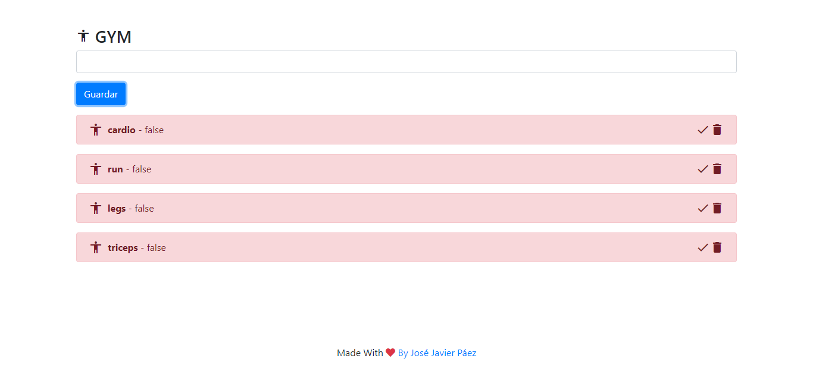

# To-Do-List-VanillaJs

This is **to-do-List** with vanilla JS in this example that i have made, am do a simulation about exercise list for the gym where am implement a **CRUD**  operations using Local Storage as Data Base 

# Application Link
if you want look the app press here [App Link](https://josejavierpaez.github.io/To-Do-List-VanillaJs/App/index.html)

# how does this work?

1. we write a exercise that we to do after, then press Save button, immediately the exercise going to show over there with status in false , it means that the action it's does not ready yet, and this  looks like:
2. After we do the exercise we have to  press the check mark, immediately the status will change to true, its  means that the exercise has already done,  and this  looks like: 
 3. If you want, you can press trash can icon to delete the exercise, and this looks like: 
 
